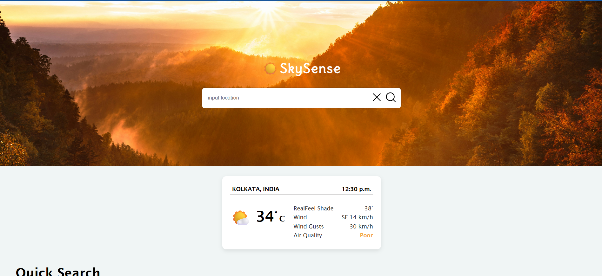

# ☀️ SkySense – Real-Time Weather App

**SkySense** is a sleek, responsive weather app built with **React** that provides real-time weather updates for cities around the globe. It uses the **OpenWeatherMap API** to fetch accurate current weather data and the **Unsplash API** to display stunning background images based on the searched city.

---

## 📸 Preview

<!-- Replace the below path with your actual screenshot path -->


---

## 🚀 Features

- 🌍 Search and view **live weather** data for any city
- 🌡️ Real-time weather information: temperature, humidity, wind speed, and conditions
- 🖼️ Dynamic, city-themed background images from **Unsplash**
- ⚛️ Built using **React Functional Components** and **Hooks**
- 📱 Fully responsive and mobile-friendly design


---

## 🛠 Tech Stack

| Technology         | Description                               |
|--------------------|-------------------------------------------|
| React              | JavaScript library for building the UI    |
| React Hooks        | Used for state and side-effect management |
| OpenWeatherMap API | Fetches real-time weather data            |
| Unsplash API       | Provides dynamic background images        |
| Axios or Fetch API | API requests                              |
| CSS                | Responsive styling                        |

---

## 📦 Installation

### 1. Clone the Repository

```bash
git clone https://github.com/your-username/skysense.git
cd skysense
```

## 🔗 API Endpoints

### 🌤 OpenWeatherMap API

- **Endpoint**:  
  `https://api.openweathermap.org/data/2.5/weather?q={city}&units=metric&appid={API_KEY}`  
- **Details Provided**:
  - Temperature (°C)
  - Weather condition (e.g., Clear, Rain, Clouds)
  - Wind speed
  - Humidity
  - Country & city name

### 🖼 Unsplash API

- **Endpoint**:  
  `https://api.unsplash.com/search/photos?query={city}&client_id={ACCESS_KEY}`
- **Details Provided**:
  - High-quality, location-based images
  - Used as background in the app UI

## 🔮 Future Improvements

- 🌍 Add support for geolocation-based weather
- 📅 Include 5-day and hourly forecasts
- 🌘 Add dark/light theme toggle
- 📈 Add temperature/weather trend charts
- 🧠 Store recent search history (with localStorage)

## 🙏 Acknowledgements

This project uses the following awesome tools and APIs:

- [React](https://reactjs.org/) – JavaScript library for building user interfaces
- [OpenWeatherMap API](https://openweathermap.org/api) – For real-time weather data
- [Unsplash API](https://unsplash.com/developers) – For dynamic background images
- [Axios](https://axios-http.com/) – For making API requests

## 🔐 Environment Variables

Create a `.env` file in the root directory of your project and add the following keys:

```env
REACT_APP_WEATHER_API_KEY=your_openweather_api_key
REACT_APP_UNSPLASH_ACCESS_KEY=your_unsplash_access_key
```
